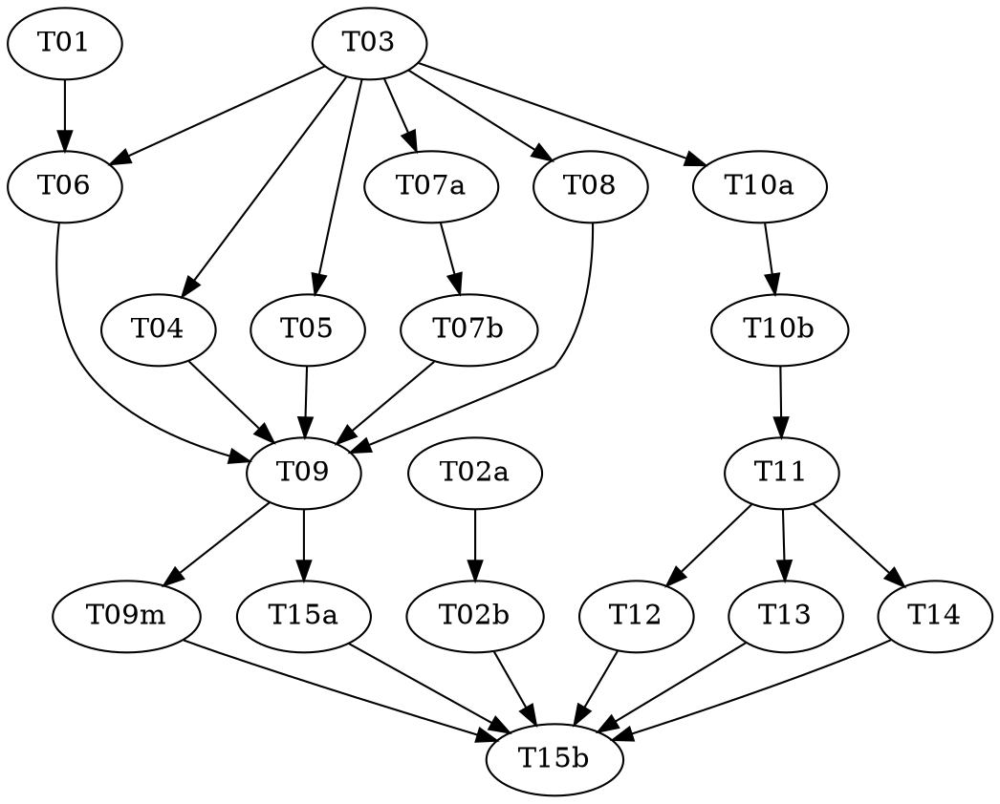

# agentics viewer: implementation plan

> **For Claude:** REQUIRED SUB-SKILL: Use vf-superpowers:subagent-driven-development (parallel,
> same session) or vf-superpowers:executing-plans (native: inline, one final review) to implement
> this plan. Steps use checkbox (`- [ ]`) syntax for tracking.

**Goal:** A local web app that draws an agentics effort's tree live from agentics' new read-only
`status.mjs snapshot`, with parks and escalations lit and announced.

**Architecture:** agentics gains one read-only command, `snapshot`, and stays the only code that
derives status. The viewer's server (Node 26, no runtime dependencies) watches a project's
`.agentics/`, runs `snapshot`, diffs for alerts, and pushes to a Vite + Preact page over SSE. All
page wording lives in a pure view model; components only render it. See
`shared/architecture.md`.

**Tech Stack:** Node 26 (runs the server's TypeScript directly), TypeScript 7.0.2, Vite 8.3.1,
Preact 10.29.8, d3-hierarchy, d3-zoom, marked, DOMPurify and Vitest 5.0.2. agentics' side is
Node ESM with `node:test`.

**Spec:** `docs/superpowers/specs/2026-09-27-agentics-viewer-design.md`, approved, with the
mockup beside it. Executors read the sections their task names.

**Planned by:** claude-opus-5-5

## Dispatch
| Stage | Model | Effort | Why |
|---|---|---|---|
| final-review | opus | medium | |

## Global Constraints

- Two repositories (`shared/architecture.md` § Two repositories). Each task names its
  repository. T02a and T02b land on agentics' `design-loop` before that plan's release task (T29,
  4.0.0) runs. Everything else lands on vanillafairy's `claude/agentics-tasks-observability-f37843`.
- Dependency versions are exact, from spec § 11. No `^` or `~`.
- The server imports only `node:` built-ins. Only `web/layout.ts`, `web/zoom.ts` and
  `web/markdown.ts` import d3, marked or DOMPurify.
- The viewer never writes under any `.agentics/`, and `snapshot` writes nothing (D12).
- `npm test` (`tsc --noEmit && vitest run`) is green at every viewer commit. In agentics,
  `node tools/lint.mjs && node --test` is green at every commit. The exception in both is a red
  task's commit, which fails only on the tests it adds.
- No test needs a DOM or imports a `.tsx` file. Time in tests comes from the injected `Clock`.
- Copy is the spec's wording, in sentence case (`shared/conventions.md` § Copy).
- T01 and T15b run inline in the main session with the user, never as subagents.
- Commit messages end with `Co-Authored-By: Claude Opus 5.5 <noreply@anthropic.com>`.

## Review Focus

1. **Paths with spaces** (`C:\Users\…\My Work\…`) in the project, the agentics install and the
   links must survive intact. Pinned by T05 'paths with spaces pass through' and T10a 'vscode
   links encode spaces and keep the drive'.
2. **Two tabs on one project.** Closing one must not stop the other from updating. Pinned by
   T09 'closing one of two streams keeps the other updating'.
3. **A page reconnecting after a server restart** must see the current board at once, not after
   the next write. Pinned by T09 'a new stream gets the latest snapshot without waiting'.
4. **A project folder deleted or renamed while watched** must say so, not hang on a stale board.
   Pinned by T09 'deleting the project folder sends project_gone'.
5. **A commit time ahead of the local clock** (another machine, clock skew) must not read
   "−3 min ago". Pinned by T10a 'a future commit time reads just now'.

---

## Dependency Graph

| Task | Role | Depends On | Files Created/Modified |
|------|------|-----------|------------------------|
| T01 | — | — | `docs/superpowers/plans/2026-09-27-agentics-viewer/knowledge/windows-powershell.md` |
| T02a | red | — | agentics: `test/snapshot.test.mjs` (authored here) |
| T02b | green | T02a | agentics: `lib/status.mjs`, `docs/DESIGN.md` (`test/snapshot.test.mjs` is READ-ONLY) |
| T03 | — | — | `agentics-viewer/{package.json, package-lock.json, tsconfig.json, vite.config.ts, vitest.config.ts, .gitignore}`, `shared/snapshot.ts`, `server/clock.ts`, `test/fake-clock.ts`, `test/fake-clock.test.ts`, `web/index.html`, `web/main.tsx` |
| T04 | — | T03 | `server/state.ts`, `test/state.test.ts` |
| T05 | — | T03 | `server/agentics.ts`, `test/agentics.test.ts` |
| T06 | — | T01, T03 | `server/projects.ts`, `server/windows.ts`, `test/projects.test.ts`, `test/windows.test.ts` |
| T07a | red | T03 | `test/watch.test.ts` (authored here) |
| T07b | green | T07a | `server/watch.ts` (`test/watch.test.ts` is READ-ONLY) |
| T08 | — | T03 | `server/alerts.ts`, `test/alerts.test.ts` |
| T09 | — | T04, T05, T06, T07b, T08 | `server/app.ts`, `test/app.test.ts`, `test/wiring.test.ts` |
| T09m | — | T09 | `server/start.ts`, `server/main.ts`, `test/start.test.ts` |
| T10a | red | T03 | `test/model.test.ts`, `test/snapshot-fixture.ts` (authored here) |
| T10b | green | T10a | `web/model.ts` (T10a's files are READ-ONLY) |
| T11 | — | T10b | `web/styles.css`, `web/stream.ts`, `web/App.tsx`, `web/Header.tsx`, `web/OpenProject.tsx`, stubs `web/{Annunciator,Outline,Board,Detail}.tsx`, `web/main.tsx`, `web/index.html`, `test/stream.test.ts` |
| T12 | — | T11 | `web/Annunciator.tsx`, `web/Outline.tsx`, `web/annunciator.css` |
| T13 | — | T11 | `web/layout.ts`, `web/zoom.ts`, `web/Board.tsx`, `web/board.css`, `test/layout.test.ts` |
| T14 | — | T11 | `web/markdown.ts`, `web/Detail.tsx`, `web/detail.css` |
| T15a | — | T09 | `.gitignore`, `.claude/launch.json`, `README.md`, `agentics-viewer/README.md` |
| T15b | — | T02b, T09m, T12, T13, T14, T15a | the spec's § 12, plus any fix commits |

Viewer paths are relative to `agentics-viewer/` unless they begin with the folder.

**Wave Schedule:**
- Wave 1: T01. Inline in the main session with the user; no controller. The toast and the dialog
  are proven before anything builds on them.
- Wave 2: T02a (~30) → T02b (~30), T03 (~26). Controller: sonnet/medium. The agentics contract, in
  its own repository, beside the viewer's scaffold.
- Wave 3: T04 (~16), T05 (~20), T06 (~26), T07a (~20) → T07b (~16), T08 (~13), T10a (~34) → T10b (~22).
  Controller: sonnet/high. Independent server pieces and the model over fixed interfaces, with two
  red/green chains.
- Wave 4: T09 (~40), T11 (~34). Controller: sonnet/high. Server wiring and the page shell, each
  the widest task on its side.
- Wave 5: T09m (~18), T12 (~18), T13 (~30), T14 (~18), T15a (~15). Controller: sonnet/medium. The
  process entry, the three components filling T11's stubs (each with its own stylesheet), and the
  READMEs.
- Wave 6: T15b. Inline in the main session with the user; no controller.

## Task Index

| ID | Name | File | Description |
|----|------|------|-------------|
| T01 | Spike: toast and dialog | tasks/T01-spike-toast-and-dialog.md | Prove the PowerShell toast and folder dialog from Node, with the user |
| T02a | Snapshot tests | tasks/T02a-snapshot-red.md | Locked tests for agentics' `snapshot` and `list.store` |
| T02b | Snapshot | tasks/T02b-snapshot-green.md | Implement `snapshotOf`, the CLI command, and the DESIGN.md contract |
| T03 | Scaffold | tasks/T03-scaffold.md | Pinned package, configs, shared types, clock and a tested fake clock |
| T04 | State file | tasks/T04-state-file.md | Read with defaults, write atomically, recent projects |
| T05 | agentics runner | tasks/T05-agentics-runner.md | Find agentics and turn its failures into problems |
| T06 | Projects and Windows | tasks/T06-projects-and-windows.md | Discovery, recent, latest effort, toast and dialog |
| T07a | Scheduler tests | tasks/T07a-scheduler-red.md | Locked tests for the refresh timing rules and watcher |
| T07b | Scheduler | tasks/T07b-scheduler-green.md | Implement the scheduler and the store watcher |
| T08 | Alerts | tasks/T08-alerts.md | The watermark diff |
| T09 | Server app | tasks/T09-server-app.md | Routes, SSE, wiring and alerts |
| T09m | Process entry | tasks/T09m-process-entry.md | Start once, build when stale |
| T10a | Model tests | tasks/T10a-model-red.md | Locked tests for lamps, wording, tiles, text and list helpers |
| T10b | Model | tasks/T10b-model-green.md | Implement the view model |
| T11 | Page shell | tasks/T11-page-shell.md | Styles, stream client, header, Open project, layout |
| T12 | Annunciator and outline | tasks/T12-annunciator-and-outline.md | Lit tiles and the node list |
| T13 | Board | tasks/T13-board.md | Tree layout, pan, zoom, after edges |
| T14 | Detail panel | tasks/T14-detail-panel.md | Everything about one node, with links |
| T15a | Repo chores | tasks/T15a-repo-chores.md | READMEs, launch entry, tracked launch.json |
| T15b | Integration | tasks/T15b-integration.md | Run against real efforts with the user; answer the lookups |

## Execution Handoff

**Plan complete and saved to `docs/superpowers/plans/2026-09-27-agentics-viewer/plan.md`.**
